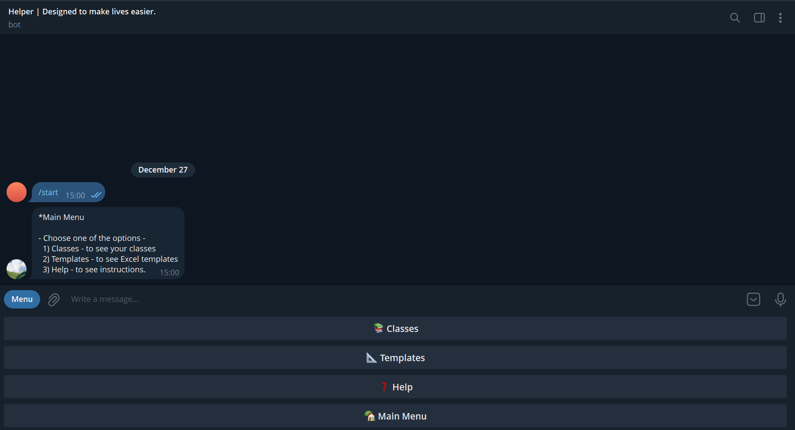
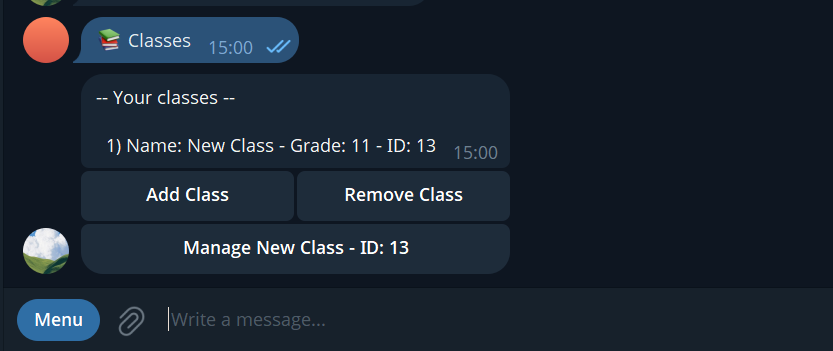
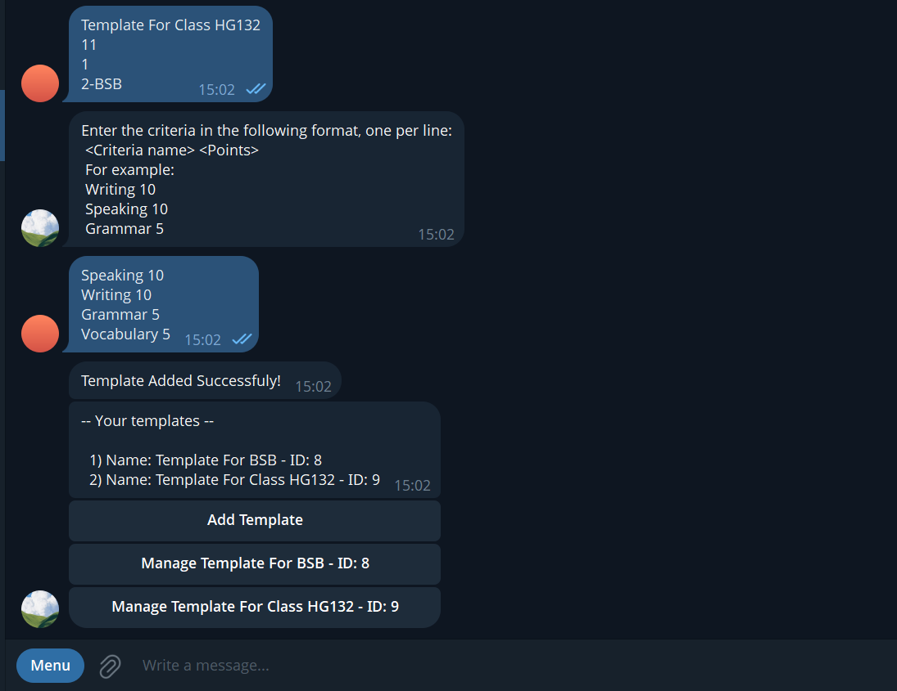

# School Grades Bot & XLSX API for Pop Specialized School Teachers 📊🤖

This Telegram bot and REST API are built specifically to help the teachers at **Pop Specialized School** automate the process of managing student grades and generating Excel reports. No more wrestling with Excel formulas—just quick, reliable grade files delivered right through Telegram.

*Note: This bot is intended for use only by authorized teachers within **Pop Specialized School**.*

---

## ⚡ Features

- Generate XLSX grade sheets programmatically  
- Telegram bot interface for quick and easy access  
- Simple API to integrate with other school systems  
- Designed exclusively for **Pop Specialized School** teachers  
- Access control via authorized Telegram usernames or whitelist  

---

## 📁 Project Structure

```
/xlsx-api               # API service source code  
  ├── handlers          # Request handlers  
  ├── models            # Data models  
  ├── services          # Services  
  ├── go.mod            # Go module file  
  ├── go.sum            # Go dependencies checksum  
  └── main.go           # API entry point

/xlsx-telegram-bot      # Telegram bot service  
  ├── cmd/bot           # Bot commands and core app code  
  │     ├── app         # Application Config
  │     ├── db          # Database access and migrations  
  │     ├── handlers    # Telegram event handlers  
  │     ├── models      # Data models    
  │     ├── go.mod      # Go module file  
  │     ├── go.sum      # Go dependencies checksum  
  │     └── main.go     # Bot entry point  
  └── migrations        # Starter database migrations for the bot  
```

---

## 🚀 Installation & Setup

### Prerequisites

- Go installed (version 1.18+)  
- Telegram bot token (create via BotFather)  
- Git installed  

### Steps

1. Clone the repository:  
   ```bash
   git clone https://github.com/dasturchiBro/xlsx-helper-api-tgbot.git
   cd xlsx-helper-api-tgbot
   ```

2. Setup and run XLSX API:  
   ```bash
   cd xlsx-api
   go mod tidy                   # Install dependencies
   # Create a .env or config file with necessary environment variables
   go run main.go
   ```

3. Setup and run Telegram Bot:  
   ```bash
   cd ../xlsx-telegram-bot/cmd/bot
   go mod tidy                   # Install dependencies
   # Create a .env or config file with TELEGRAM_BOT_API
   go run main.go
   ```

---

## 🗄️ Database (PostgreSQL)

This project uses PostgreSQL.

### Schema
The database structure is provided in:

migrations/schema.sql

No real student data is included.

### Setup
1. Create a PostgreSQL database
2. Configure environment variables
3. Apply schema:

```bash
psql -U postgres -d xlsx_bot -f migrations/schema.sql
```
---

## ⚙️ Configuration

### XLSX API (`xlsx-api`)

| Variable | Description                | Example  |
|----------|----------------------------|----------|
| PORT     | Port for the API to listen | `8080`   |

### Telegram Bot (`xlsx-telegram-bot/cmd/bot`)

| Variable          | Description                         | Example                        |
|-------------------|-----------------------------------|-------------------------------|
| TELEGRAM_BOT_API | Token from BotFather for your bot | `123456789:ABCdefGHIjklMnop`  |

Use `.env` files or environment variables to set these securely.

---

## 🎯 Usage

### XLSX API

- Send a POST request to `/v1/xlsx` endpoint with JSON payload containing student grades and info.  
- API responds with a downloadable XLSX file URL.

Example cURL request:

```bash
curl -X POST http://localhost:8080/v1/xlsx \
 -H "Content-Type: application/json" \
 -d '{
   "header": ["Name", "Math", "English"],
   "criteria": ["Exam1", "Exam2"],
   "students": [
     {"name": "Ali", "points": [85, 90]},
     {"name": "Zara", "points": [92, 88]}
   ]
 }'
```

### Telegram Bot

- Open your Telegram bot  
- Send command `/start` (or other implemented commands)  
- Receive Excel grade reports directly in chat  
- Only authorized teachers can use the bot

---


## 📜 License

This project is licensed under the MIT License. See the [LICENSE](LICENSE) file for details.

---

## 📸 Screenshots / Demo

<p align="center">
  
  
  
  
</p>
---

# Stay hard. Keep building.
